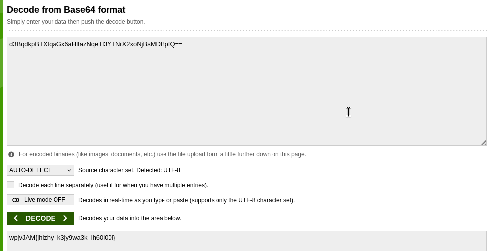
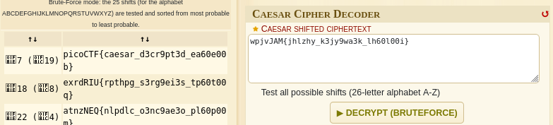

## Interencdec - Easy - [PICOCTF]

## Deskripsi soal
Can you get the real meaning from this file.

## Aha Momment
Tantangan ini memberikan satu file enc_flag yang isinya adalah kombinasi encoding, karena didalam kombinasi tersebut mudah sekali dianalisa pada bagian akhir kombinasi terdapat digit == dan 
kombinasi mengandung digit A-Za-z0-9 yang menandakan pesan di encode dengan base64, lalu pada kombinasi tersebut juga dienkripsi lagi menggunakan Caesar Chiper. Hal yang membuat saya curiga adalah 
adanya simbol {} diantara kombinasi sehingga berkemungkinan kombinasi ini hanya memainkan pergeseran posisi saja

## Langkah-langkah 
1. Unduh file tantangan: enc_flag

2. Copas isinya dan decode menggunakan decoder base64 online [base64 decoder](https://www.base64decode.org/)

3. Copas lagi hasil decoder base64 nya, lalu decrypt kuncinya menggunakan caesar chiper online decoder [Caesar chiper decoder](https://www.dcode.fr/caesar-cipher)

4. Demm flagnya berhasil didapatkan.

```                                                                         
FLAG: picoCTF{caesar_d3cr9pt3d_ea60e00b}                                                                                                                                                                                        
```                                                                                                                                                                                                                                                                                                                                                                                                  
                                                                                
