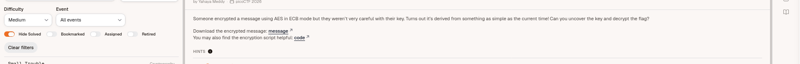

## Timestamped Secrets - Medium - [PICOCTF2026]

## Deskripsi soal
Someone encrypted a message using AES in ECB mode but they weren’t very careful with their key. Turns out it’s derived from something as simple as the current time! Can you uncover the key and decrypt the flag?

## Aha Momment
Setelah saya analisa source code yang diberikan dan memahami deskripsi soal, tantangan ini memiliki celah kerentanan yang sangat fatal dimana pesan dienkripsi dengan AES (Advanced Encryption Standard) menggunakan mode ECB (Electronic Code Book) lalu key digenerate menggunakan timestamp. Oleh karena itu, celah ini yang saya manfaatkan untuk generate ulang keynya. Timestamp memiliki sifat yang mudah ditebak karena menggunakan rentang waktu

## Langkah-langkah 
1. Unduh semua file yang diberikan

2. Buat script untuk deskripsi Ciphertext nya
```
#decryption.py
#-------------------------------------------
#   Import library yang dibutuhkan
#-------------------------------------------

import hashlib
from Crypto.Cipher import AES
from Crypto.Util.Padding import unpad

#---------------------------------------------
#   Masukkan ciphertext dan timestamp dari message.txt
#--------------------------------------------
ciphertext_hex = ""
ciphertext_bytes = bytes.fromhex(ciphertext_hex) #Ubah dari hex ke bytes

timestampClue = 

#---------------------------------------------
#  Fungsi untuk generate ulang keynya
#--------------------------------------------
def make_key(timestamp):
	return hashlib.sha256(str(timestamp).encode()).digest()[:16]

#---------------------------------------------
#   Fungsi untuk mencoba deskripsi
#--------------------------------------------
def try_decrypt(timestamp, ciphertext_bytes):
	key = make_key(timestamp)
	cipher = AES.new(key, AES.MODE_ECB)

	try:
		decrypted = cipher.decrypt(ciphertext_bytes)
		plaintext = unpad(decrypted, AES.block_size)
		return print(plaintext)
	except (ValueError, KeyError):
		return None

try_decrypt(timestampClue, ciphertext_bytes)
```
3. Jalankan dengan python3 decryption.py
4. Demm flag berhasil didapatkan

```                                                                         
FLAG: picoCTF{sa3S_sEc9t_9201873c}                                                                                                                                                                       
```                                                                                                                                                                                                                                                                                                                                                                                                  
                                                                                
