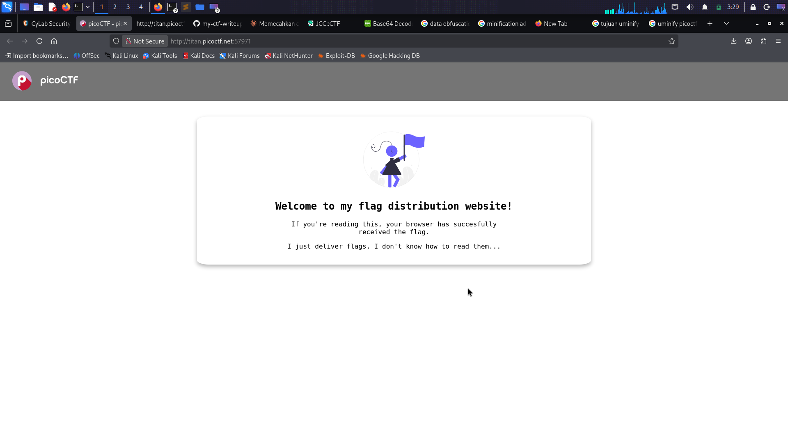
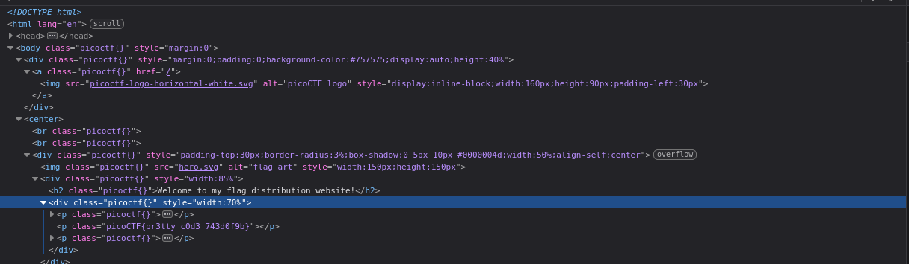

## Uminify - Easy - [PICOCTF]

## Deskripsi soal
I don't like scrolling down to read the code of my website, so I've squished it. As a bonus, my pages load faster!

## Aha Momment
Ketika buka websitenya kita langsung diberikan clue yang sangat jelas dimana ketika buka websitenya sudah diberikan flagnya. Minifikasi adalah metode untuk meringkas,merapikan dan memperkecil ukuran website sehingga lebih ramah SEO dan cepat,tetapi tidak memungkinankan data yang sensitif akan ikut disembunyikan

## Langkah-langkah 
1. Buka halaman website yang diberikan

2. Inscpect element dan perhatikan kode dibawah ini

3. Dan demm flagnya ditemukan

```                                                                         
FLAG: picoCTF{pr3tty_c0d3_743d0f9b}                                                                                                                                                                                        
```                                                                                                                                                                                                                                                                                                                                                                                                  
                                                                                
