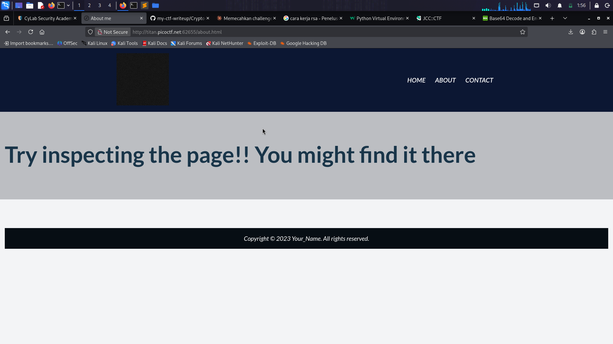
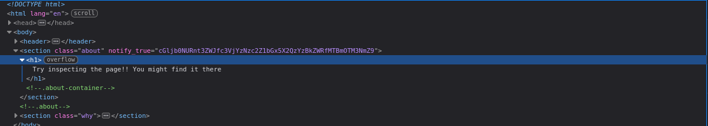

## WebDecode - EASY - PICOCTF 

## Deskripsi soal
Do you know how to use the web inspector?

## Aha Momment
Ketika sedang explorasi websitenya, banyak keanehan yang saya lihat terutama pada page about terdapat heading yang menyuruh kita untuk inspect browser ketika saya cek ada hasil encoding yang diselipkan pada
bagian tag section, encoding itu adalah hasil dari base64 karena outputnya memiliki format seperti berikut A-Za-z0-9

## Langkah-langkah 
1. Masuk ke halaman website yang diberikan dan pergi kehalaman about

2. Inspect browser dengan F12, lalu copas atribute ini notify_true="cGljb0NURnt3ZWJfc3VjYzNzc2Z1bGx5X2QzYzBkZWRfMTBmOTM3NmZ9"

3. Copas dan decode menggunakan decoder base64 online [base64 decoder](https://www.base64decode.org/)

4. Dan demm flagnya ketemu
```                                                                         
FLAG: picoCTF{web_succ3ssfully_d3c0ded_10f9376f}                                                                                                                                                                             
```                                                                                                                                                                                                                                                                                                                                                                                                  
                                                                                
